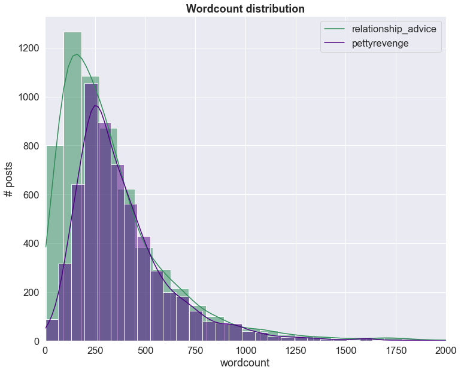

#  Project 3: Web APIs & NLP

### Problem Statement

The goal of this project is to create a Natural Language Processing (NLP) classifier.  The narrative for presentation was a far-fetched scenario but goes as follows:  
'The previous moderator of Reddit's popular forums r/Relationship_advice and r/Pettyrevenge has been forced to resign due to excessive content removal, and on his way stepping down from power he burned the house down.  He has sabotaged his successor by stripped te classifications from all posts made during his tenure.  It is our job to go about resotring post to their proper threads so users can interact with their desired communities.  Sloppy classification risks offending constituents of both subreddits.  Archived data will be used to build a classifier.'  

This project utilizes webscraping, sklearn's NLP toolkit, EDA, and iterative modeling to provide several classifiers that can sort these subreddit posts with >- .95 F1 scores, accuracy, and recall.

---

### Methods

Posts were scraped from subreddits 'pettyrevenge' and 'relationship_advice' via looping over [Pushshift's](https://github.com/pushshift/api) API.  About 6,500 documents per subreddit were initially retrieved, and after cleaning the final dataset consists of 6,093 posts from 'relationship_advice' (51%) and 5,907 posts from 'pettyrevenge'.  The code for the retrieval and dataframe creation is in Notebook A.  

Cleaning involved dropping 'removed' and 'deleted' posts, removing URLS (and any items whose text were exclusively URLs).  Structural characteristics such as number of sentences per post, average sentence length, and use of punctuation were preserved in new columns, then all special characters were stripped from the documents to allow for efficient lemmatization and vectorization.  This occurs in Notebook B, along with all EDA and visualizations.  

All modeling utilizes the lemmatized and special-character-stripped versions of the posts as X features, with the target of 'subreddit'.  None of the additional structural components were used in the classification models.  Much of the modeling experimentaiton was performed on a subset of the corpus; all hyperparameters were tuned in RandomSearchCV.  Three models are defined in Notebook C and fit to the whole (training) data.  Model results were pstored via pickle so their parameters and scoring metrics could be retrieved without rerunning monster fits.  The three final models include:
* Multinomial Bayes with CountVectorization
* Support Vector Classification with Term frequency-inverse document frequency (Tfidf) vectorization
* Logistic Regression classifier with CountVectorization

---

### Summary

The language of the subreddits was more easily (or at least accurately) classifiable than expected, based on the consistent high scores across multiple models.  Only Decision Trees showed significant overfitting (as expected), and tinkering to reduce this variance yielded much lower scores.  Beyond that example, all models tested here yielded similar results even in the face of very different RandomSearch parameters in subset testing.

All models presented here (and many iterations not presented) yielded similar scores: consistently in the mid-90s for F1, accuracy, recall, etc.  The SVC-TfIdf model yielded the best scores overall, with the following hyperparameters:
- C = 0.63
- degree = 2
- tfidf max df = .932
- tfidf max features = 4739
- tfidf min df = .0022

SVC is a blackbox model so there is no coefficient interpretation resulting from this output.  The logreg model was included specifically to provide interpretable coefficients, but the model did not converge despite several refits.  Not converging means there isn't definitive interpretation for the coefficients resulting from that model, yet the scores were still mid-90s.  
  
EDA of the structural components show a few distinctions between the subreddits: pettyrevenge has a higher average word- and sentence-count, and trigram analysis shows a distint differentiation between each class.  

While many of the most frequent words for each subreddit were shared, looking at the ratio of word occurrence between the classes gives some valuable information for classification.  For instance, the word 'want' is frequent in both classes, but is 5 times more likely to appear in relationship_advice.  The two biggest indicators were 'Feel' (10x more likely to be in relationship_advice) and 'Car' (7x the change of being in pettyrevenge).  These words from this EDA analysis were commonly among the important features of the models in Notebook B.

---

### Conclusions

In the problem scenario of having to properly classify these reddit posts as the new moderator, my conclusion is to use the SVC classification model with TfIdf vectorization.  Overall, models did not require extensive finetuning after the intitial RandomSearch.  Future steps that I will pursue later for practice are several: 
1. pursuing a random forest model: I wanted to see this bootstrapping in action and what difference it might bring to the baseline decision tree.  However, performance was so high on other models it was a lower priority to pursue this model in the scope of answering the research question.
2. Get the logreg model to converge.  What impact does this have on score and the parameters determined in the non-converged version?  Do the coefficients align with the relationships articulated in EDA?
3. Incorporating the structural features (punctuation count, sentence length) into the classifier alongside vectorized data to see what difference that makes.  Can similar scores be achieved working with a fraction of the vectorized data if these structural components are significant?  This would save a lot of computational energy.

This project was multifaceted and interesting, despite feeling under the gun when it came to presenting findings.  The webscraping in particular was completely foreign to me and it was enlightening to see how it works.  I'm excited for what this might mean for data accessibility for capstone.