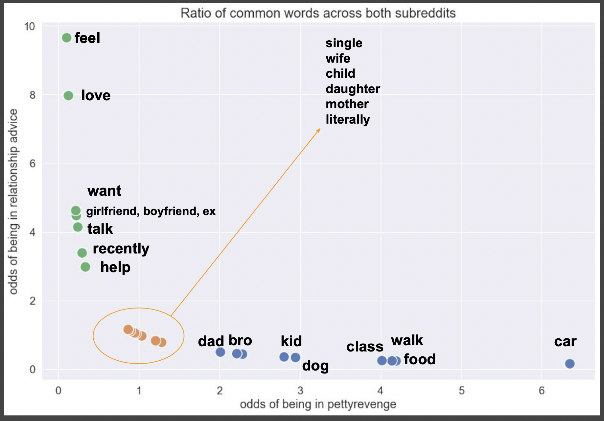

# Web APIs & NLP

### Problem Statement

The goal of this project is to create a Natural Language Processing (NLP) classifier.  The narrative for presentation was flippant, for the purpose of keeping a student audience interested:
'The previous moderator of Reddit's popular forums r/Relationship_advice and r/Pettyrevenge has been forced to resign due to excessive content removal, and while stepping down from power he burned the house down behind him.  He has sabotaged his successor by stripping the identification info from all posts made during his tenure.  It is our job to go about restoring posts to their proper threads so users can interact with their desired communities.  Sloppy classification risks offending constituents of both subreddits.  You have access to some archived data that are still properly identified.  Can you create a classifier to sort through the chaos?'  

This project utilizes webscraping, sklearn's NLP toolkit, EDA, and iterative modeling to provide several classifiers that can sort these subreddit posts with >- .95 F1 scores, accuracy, and recall.

---

### Methods

Posts were scraped from subreddits 'pettyrevenge' and 'relationship_advice' via looping over [Pushshift's](https://github.com/pushshift/api) API.  About 6,500 documents per subreddit were initially retrieved, and after cleaning the final dataset consists of 6,093 posts from 'relationship_advice' (51%) and 5,907 posts from 'pettyrevenge'.  The code for the retrieval and dataframe creation is in Notebook A.  

Cleaning involved dropping 'removed' and 'deleted' posts, and removing URLS.  Structural characteristics such as number of sentences per post, average sentence length, and use of punctuation were then preserved in new columns. Finally, all special characters were stripped from the documents to allow for efficient lemmatization and vectorization.  This occurs in Notebook B, along with all EDA and visualizations.  

All modeling utilizes the lemmatized and special-character-stripped versions of the posts as features, with the target of 'subreddit' (binary classification).  The additional structural components were used only for EDA and visualization; they were no included in the classification models.  Much of the modeling experimentaiton was performed on a subset of the corpus; all hyperparameters were tuned in RandomSearchCV.  Three models are defined in Notebook C and fit to the whole (training) data.  Model results were pickled so their parameters and scoring metrics could be retrieved without rerunning monster fits.  The three final models include:
* Multinomial Bayes with CountVectorization
* Support Vector Classification with Term frequency-inverse document frequency (Tfidf) vectorization
* Logistic Regression classifier with CountVectorization

---

### Summary

The language of the subreddits was more easily (or at least more accurately) classifiable than expected, based on the consistent high scores across multiple models.  Only Decision Trees showed significant overfitting, and tinkering to reduce this variance yielded much lower scores across all classification metrics.  Beyond that example, all models tested here yielded similar results even in the face of very different RandomSearch parameters in subset testing.

All models presented here (and many iterations not presented) yielded similar scores: consistently in the mid-90s for F1, accuracy, recall, etc.  The SVC-TfIdf model yielded the best scores overall, with the following hyperparameters:
- C = 0.63
- degree = 2
- tfidf max df = .932
- tfidf max features = 4739
- tfidf min df = .0022

SVC is a blackbox model so there is no coefficient interpretation resulting from this output.  The logreg model was included specifically to provide interpretable coefficients, but the model did not converge despite several refits.  Not converging means there isn't definitive interpretation for the coefficients resulting from that model, yet the scores were still mid-90s.  
  
EDA of the structural components show a few distinctions between the subreddits. Pettyrevenge has higher average word- and sentence-counts. Trigram analysis was distinctly unique as well: once a robust list of stopwords was included, there were only 4 remaining trigrams and the frequency between classes was almost directly inverse.

While many of the most frequent words for each subreddit were shared, looking at the ratio of word occurrence between the classes gives some valuable information for classification.  For instance, the word 'want' is frequent in both classes, but is 5 times more likely to appear in relationship_advice.  The two biggest indicators were 'Feel' (10x more likely to be in relationship_advice) and 'Car' (7x chance of being in pettyrevenge).  These words from this EDA analysis were commonly among the important features of the models in Notebook B. Funnily enough, most family members had 1:1 odds of being in either subreddit, but 'dad' and 'brother' tended to appear more frequently in Petty Revenge. Checks out.

 

---

### Conclusions

In the scenario of having to properly classify these reddit posts as the new moderator, my conclusion is to use the SVC classification model with TfIdf vectorization.  Overall, models did not require extensive finetuning after the intitial RandomSearch.  Future steps to pursue later for practice are several: 
1. Try a random forest model: given the low performance of the solo decision tree, this will be a good example to illustrate what difference bootstrapping can impart upon a weak baseline.  Performance was so high on other models that this was a low priority in the scope of answering this research question, but it could be an educational demo.
2. Get the logreg model to converge.  What impact does this have on score and the parameters determined in the non-converged version?  Do the coefficients align with the relationships articulated in EDA?
3. Incorporating the structural features (punctuation count, sentence length) into the classifier alongside vectorized data to see what difference that makes. A. Can this improve model performance? And more interestingly, B. Can similar (or better) scores be achieved working with a fraction of the vectorized data if these structural components are significant?  This would save a lot of computational energy. Though not limiting in this exercise, computational efficiency is an important consideration for larger-scale applications.

This project is a multifaceted demo of NLP tools and methodologies. For those wishing to finetune or compare NLP model performance, there is room to explore further from this code (per the steps above, or independently); the complete corpus is provided in the Data folder for just that purpose. Enjoy, and please cite with a link if referencing.
